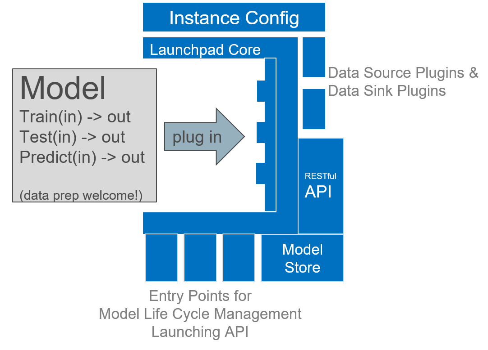

.. highlight:: shell

==============================================================================
Description
==============================================================================

Why ML Launchpad?
------------------------------------------------------------------------------

ML Launchpad is an extensible Python package which makes
it easy to publish Machine Learning models as
RESTful APIs.

It separates the Machine Learning side
(how to train, test and to predict) from the
environment-specific aspects (local or cloud deployment of the API,
database connections, format validation, model storage, etc.)

Configure and deploy ML Launchpad *once*, and the model developer
can publish an unlimited number of different Machine Learning
algorithms as they
are needed, relieving them of having to deal with
deployment specifics.

While most approaches for streamlining Machine Learning solutions
force you to select a particular set of machine learning libraries
and/or a particular platform, ML Launchpad is agnostic to those,
retaining the flexibility to choose any algorithm and any
platform.

Structure
------------------------------------------------------------------------------

On the environment side, ML Launchpad sports a configurable
REST API (using Flask), that can be run on any WSGI-compatible
server.

Retrieving and persisting data is done through an extensible
abstraction mechanism, called Data Sources and Data Sinks.
Common types of Data Sources and Sinks like relational
databases and CSV files are already included.

The model "payload" itself is the only time where code needs
to be produced by the model developer. Here, the developer is
basically filling in three functions in an R or Python template
(Spark support is planned):

* ``train`` - uses data provided by Data Sources and returns
  a trained model object
* ``test`` - uses the provided model object and Data Sources and
  returns metrics about the model
* ``predict`` - uses the provided model object and (validated)
  API parameters to carry out a prediction and returns the
  prediction result

This is all the programming that is needed.

While enforcing the division into three functions might seem
restrictive at first glance, in reality
it makes simple things straightforward, while complex things are
still achievable without complication due to the flexibility
and configurability of ML Launchpad.

ML Launchpad handles how these functions are called, and what
to do with the results. That way, the model can, unchanged,
run on e.g. a Windows developer laptop using
flat files, or a Linux cloud instance using databases.

How the model and the environment work together is defined using
a configuration file. The RESTful API is defined using a
RAML file (RESTful API Modeling Language).

Life of a Model
------------------------------------------------------------------------------

First, the model developer pip-installs the ``mllaunchpad``
package so they can use it in their project.

Then, they use the ``TEMPLATE_*`` files
available in the ``examples`` directory to create three
files in their project: a model file
like ``<my_model_name>.py``, a configuration file like
``<my_model>_cfg.yml`` and a REST API definition file like
``<my_model>.raml``.

(To help with getting the RAML file started, the command
``mllaunchpad -g my_source`` is used.)

If everything is filled in, it is time to train the model::

  $ mllaunchpad -c <my_model>_cfg.yml -t

The trained model is persisted in the ``model_store`` location
defined in the configuration file.

Note: Feel free to use the command line or the ML Launchpad's
Python convenience API functions. Instead of using the ``-c``
parameter, the location of the configuration
file can also provided by setting the ``LAUNCHPAD_CFG`` environment
variable (or implicitly by providing a file named ``LAUNCHPAD_CFG.yml``
in the current working directory).

To test, the developer runs a (debugging-only!) REST API for
the model, using the command
``-a``::

   $ mllaunchpad -c <my_model>_cfg.yml -a

They test the API, and if it works as expected, the model
can be used in a proper WSGI server, like for example
gunicorn behind nginx.

There comes a time when the deployed model starts to get out of date.
To re-test the previously trained model, use the command ``-r``
or the Python API convenience functions::

   $ mllaunchpad -c <my_model>_cfg.yml -r

The location of the configuration file (as well as that of a logging file)
can also be provided by setting the environment variables ``LAUNCHPAD_CFG``
and ``LAUNCHPAD_LOG``, respectively. If neither a parameter nor an
environment variable is available, ``mllaunchpad`` will look for a file
named ``LAUNCHPAD_CFG.yml`` in the current working directory.

Besides through the command line, the main functionality is also made
available through a Python convenience API.
See :meth:`mllaunchpad.train_model`,
:meth:`mllaunchpad.retest` and :meth:`mllaunchpad.predict`.

.. _extending:

Extensibility
------------------------------------------------------------------------------

ML Launchpad is designed with extensibility in mind.

The ML Launchpad package does not come with the whole kitchen sink,
but still contains enough functionality to be able to deploy a
complete Machine Learning API.

If the functionality which is provided is not sufficient,
it can be extended in two major ways:

Without needing to modify the base package:

* Adding new Data Source and Data Sink Extensions
* Adding new Model Type Extensions
* Using the Python Convenience API for implementing custom
  model life cycle management logic

Through contributions to the base package:

* Adding support for OpenAPI specs in addition to RAML
* Anything else :)

New types of Data Sources and Data Sinks can be added simply
by extending the base classes in a Python module of your own and
listing it in the ``plugins:`` section of your configuration.

New types of models (programming languages etc.) can be supported
by creating a python model which acts as a bridge to the desired
technology. In that sense, models already act like extensions.

Support for ``pip install``-able extensions is on the roadmap,
too. If you want to help, that's awesome! Let your voice be
heard at the corresponding GitHub issue.

Deployment Requirements
------------------------------------------------------------------------------

From a Python perspective, ML Launchpad only depends on a handful of
Python packages, which are automatically installed with
``pip install mllaunchpad``. We recommend using a Python virtual
environment such as `venv <https://docs.python.org/3/library/venv.html>`_.

For running an actual Machine Learning model in ML Launchpad, you
need, as a minimum:

* Training data and test data for your model (in a format and location
  that is
  accessible for the built-in DataSources). Side note: Validation data
  here counts as a part of training data because validation happens during
  the model creation phase.
* A python module (``.py`` file) containing the implementation
  of the ``create_trained_model``, ``test_trained_model``
  and ``predict`` methods of the model interfaces.
* A file system location that will become the ``model_store``.
* An API definition in form of a ``.raml`` file, e.g. generated using
  the ``-g`` parameter of the ``mllaunchpad`` command line tool, and
  adapted.
* A model configuration file that ties the above together.
* Any computer to run the training and/or the API on.

The above are sufficient for trying out the model locally or on
a test server (be it a virtual or physical machine).

ML Launchpad does not prescribe a lot of choices outside of its own
realm. This makes it possible to run it in a large variety of
different systems and environments (essentially anywhere where you
can run Python).

This compatibility means that it is not production-ready out of the box.
It is meant to be used in conjunction with other tools that are
specialised on providing the missing features.

Here's a by no means ideal, but relatively simple
example scenario for an ML Launchpad production
deployment of one model in a low to medium load setting:

* Deployment on a single Linux VM instance (for now),
  with its own user to run as,
  in a subfolder of the user home,
  e.g. called ``example``. A Python virtual environment
  within which to do ``pip install mllaunchpad`` is not strictly
  necessary, but useful if several models are going to be deployed.
* Model config file and RAML file live in the same folder.
* Your Python module with the model code lives here as well.
* ``model_store`` in the config file points to a subfolder.
* We also adapt the existing ``logging_cfg.yml`` file to fit our
  purposes.
  The file system structure so far looks like this::

    /home/
      - my_user/
        - example/
          - .venv
          - my_model.py
          - my_config.yml
          - logging_cfg.yml
          - my.raml
          - model_store/

* The data sources in the config file point to where the data
  can be reached from this machine/user (e.g. csv files on a
  network mount, some DBMS server, etc.). Same for ``my_model.py``.
* To simplify our commands later, we put the locations of the
  config and log-config files in ML Launchpad environment
  variables by extending the ``.bashrc`` file::

    export LAUNCHPAD_CFG=/home/my_user/example/my_config.yml
    export LAUNCHPAD_LOG=/home/my_user/example/logging_cfg.yml
    # auto-enable our python virtual environment:
    cd /home/my_user/example
    source .venv/bin/activate

* Training is scheduled e.g. weekly, using a tool like
  ``cron`` or Control-M, which
  calls::

    mllaunchpad -t

* For now, we'll not configure any re-testing of our deployed
  example model.
* The API in this example is run using ``gunicorn``
  (``pip install gunicorn``), where the launch command is something like::

    $ gunicorn --workers 4 --bind 127.0.0.1:5000 mllaunchpad.wsgi

* Because ML Launchpad's builtin API does not provide any encryption, user
  management or load balancing, we outsource this to tools which are
  better at this, like ``nginx`` (which needs its own configuration
  file, of which you can find an example in the
  `examples download <https://minhaskamal.github.io/DownGit/#/home?url=https://github.com/schuderer/mllaunchpad/tree/master/examples>`_)::

    $ nginx -c /home/my_user/example/nginx.conf -p /home/my_user/example/nginx

* We don't want to have to log in to interactively
  start ``gunicorn``, then ``nginx``,
  so it is recommended to make these two a `systemd service <https://medium.com/@benmorel/creating-a-linux-service-with-systemd-611b5c8b91d6>`_
  (specifying their interdependence using the ``After`` keyword).
* If you're in a corporate network which uses an Enterprise Service
  Bus like ``Mule``, you can use the existing RAML file as a basis
  for creating the service.

This kind of deployment can be adapted to multiple models, for
example by:

* adding more subfolders besides ``example``,
* making ``systemd`` use the virtual environment
  (prepending ``/home/my_user/example/.venv/bin`` to
  the ``PATH``) instead of activating it in ``.bashrc``,
* creating one ``systemd`` ``gunicorn`` service per model using
  different port numbers, and
* adapting the ``nginx.conf`` to serve all of these port numbers.

Of course, with Web API deployment being the complex subject it is,
we only scraped the surface and there are a lot more
alternatives available, such as replacing ``gunicorn`` by another
WSGI-compatible server like Apache with ``mod_wsgi``, using containers,
automatising scaling, etc.
